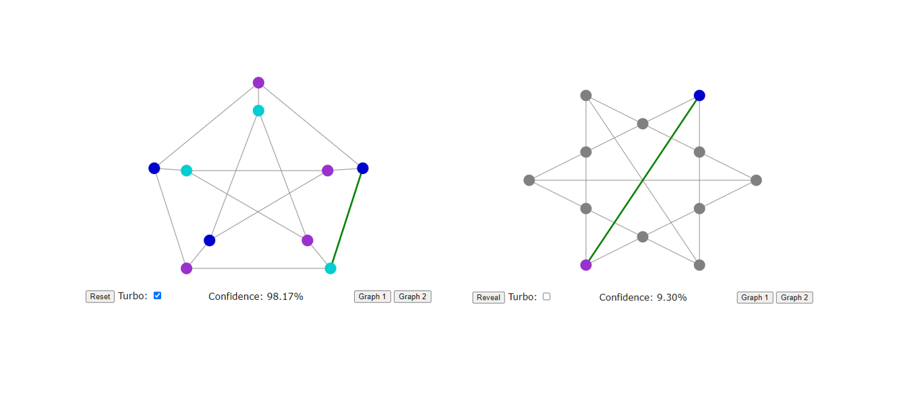
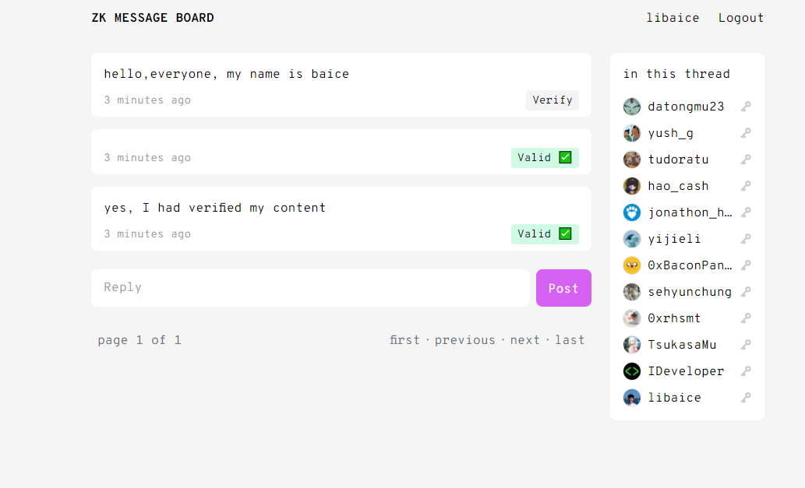

# 第1课 课后作业

## 第1题 ZKP for 3-coloring Demo

Visit http://web.mit.edu/~ezyang/Public/graph/svg.html and play around with the interactive demo. This is a programmatic version of the 3-coloring example we went over in class.

Exercise 1: Currently, you can only select adjacent pairs of nodes to check. Would the proof still be zero knowledge if you could pick arbitrary pairs of nodes to check?

> Answer:
>
> 当前我们使用的是通过任意两个通过一条边相邻的两节点来verify的，这样是可以验证成功的。但如果通过随机的两个节点来进行验证，这样就 **不是零知识证明** 了。
>
> 零知识证明的本质是：我作为验证者来证明prover 提出的statement 是正确的。当前prover提出的statement 为: 当前的图形是可以由一条边两节点为不同颜色，可以由三种颜色来满足整个图形 (三色问题)，而其他的信息我是全部都不知道的。
>
> 如果可以使用任意两个节点来进行比较验证，那么就不符合**[Zero Knowledge]** The Prover’s responses don’t reveal the underlying information.] 这样的特点，那么我就可以通过一个点有其他各个点的颜色对比，从而就直接可以把最后的答案(三色结果)暴露出来。

## 第2题 Optional - ZKP for DLOG

TODO

948e58266f0aaff454fb1d46fc02ca29ffcb7b6c9f7905feb5f4742051ac7087

## 第3题 zkmessage.xyz

Create an account and post a message on [zkmessage](https://zkmessage.xyz/), a zkSNARK-powered anonymous message board.

- Explain why you need to generate and save a “secret” value.
- Write out a plain-English explanation of what statement is being proven in ZK.
- Log into the same zkmessage account, from a different browser or computer. Explain why zkmessage can’t just use a simple “username/password” system like most social apps.

If you’re curious, we go much deeper into the construction of zkmessage [here](https://0xparc.org/blog/zk-group-sigs).

---

1. secret key 是用来绑定我的twitter，生成公钥，为message 签名的私钥。将我的 secret key 保存下来，用作作为登录zkmessage 面板的"access token" 。

   

2. 我可以Verify 一条message是否是正确的，如果正确，则别打成Valid的tag。而最终想要证实的statement 则是： 这条message 是又拥有这个人的"secret key"的用户发出来的。

   

3. 使用同一个 secret key , 我可以在 chrome 上面登录，也可以在Edge browser 上面登录，最终看到的结果是一样的。而如果使用Web2 方式的"username + password"来进行鉴权登录，那就不是zk的验证，这样也就引入了一个中心化的服务器来管理自己的信息。而这样，也就不能确定这条信息是是真的这个用户发送的，还是服务器来代替用户发送的信息。