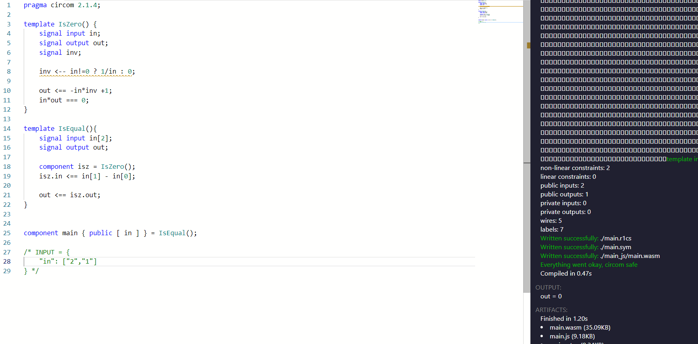

# 第2课 课后作业


第二堂课程的笔记基本都是在对[circomlib](https://github.com/iden3/circomlib)里面的电路仓库进行练习。

这里的所有电路都可以在一个在线工具 [zkrepl.dev](https://zkrepl.dev/)里面来运行。


## 第1题 Num2Bits

- Parameters: `nBits`
- Input signal(s): `in`
- Output signal(s): `b[nBits]`

The output signals should be an array of bits of length `nBits` equivalent to the binary representation of `in`. `b[0]` is the least significant bit.

这个电路template的参数是一个nBits ，想要输出一个能够代表 in的一个长度为nBits的数组 b[nBits]。


```
pragma circom 2.0.0;

template Num2Bits(n) {
    signal input in;
    signal output out[n];
    var lc1=0;
    var e2=1;
    for (var i = 0; i<n; i++) {
        out[i] <-- (in >> i) & 1;
        out[i] * (out[i] -1 ) === 0;
        lc1 += out[i] * e2;
        e2 = e2+e2;
    }
    lc1 === in;
}

component main {public [in]}= Num2Bits(3);

/* INPUT = {
    "in": "6"
} */
```

> 注：
>
> * 这段代码的参数是nBits 即3， 既然最多只能有3位，那么最大的数即 111 -> 7， 输入小于等于7的input，整个电路便可正常执行。
> * b[0] 即 out[0]是有效最低位，则输出的结果的应为正常排列bit 的反序，即b[n]放在第一位，b[0]放在最后。
> * out[i] * (out[i] -1 ) === 0; 为一个constraint 约束，任意一位要么为0，要么为1，[x* (x-1) = 0]
> * lc1 为使用反推的方式来验证 最后的结果  — 输入的in 与从bit 转成的Num数字是否相同。


### 第2题 IsZero


- 参数：无
- 输入信号：`in`
- 输出信号：`out`

要求：如果`in`为零，`out`应为`1`。 如果`in`不为零，`out`应为`0`。 


```
pragma circom 2.1.4;

template IsZero() {
    signal input in;
    signal output out;

    signal inv;

    inv <-- in!=0 ? 1/in : 0;

    out <== -in*inv +1;
    in*out === 0;
}

component main { public [ in ] } = IsZero();

/* INPUT = {
    "in": 0
} */
```


> 注:
>
> * 代码没有参数，一个输入值和一个输入值来判断输入值是否为0，输入为0，输出out则为1，反之亦然。
> * 信号inv 是一种中间值来计算输入值的倒数 或者为0
>   * 输入值非0， inv =  1/in  , out 则为 -1+1 = 0 ， 满足约束[ in * out === 0 ]
>   * 输入值为0， inv = 0, out 则为 -0+1=1, 满足约束 [ in * out === 0 ]
> * 实际运行后，根据不同输入in 的值，获得的结果也符合预期。


### 第3题 IsEqual

- 参数：无
- 输入信号：`in[2]`
- 输出信号：`out`

要求：如果 `in[0]` 等于 `in[1]`，则 `out` 应为 `1`。 否则，`out` 应该是 `0`。

```
template IsEqual() {
    signal input in[2];
    signal output out;

    component isz = IsZero();

    in[1] - in[0] ==> isz.in;

    isz.out ==> out;
}
```

> 注:
>
> * 参数和output这两部分是确定的, 这里借用了上面IsZero circuit 中的逻辑，使用两数之差来和0比较。
> * 把两数之差作为 isz 的输入，直接将isz的输出作为本题的输出。

 

### 第4题 选择器 Selector

- 参数：`nChoices`
- 输入信号：`in[nChoices]`, `index`
- 输出：`out`

要求：输出`out`应该等于`in[index]`。 如果 `index` 越界（不在 [0, nChoices) 中），`out` 应该是 `0`。


```
template QuinSelector(choices) {
    signal input in[choices];
    signal input index;
    signal output out;

    component calcTotal = CalculateTotal(choices);
    component eqs[choices];

    // For each item, check whether its index equals the input index.
    for (var i = 0; i < choices; i ++) {
        eqs[i] = IsEqual();
        eqs[i].in[0] <== i;
        eqs[i].in[1] <== index;

        // eqs[i].out is 1 if the index matches. As such, at most one input to
        // calcTotal is not 0.
        calcTotal.in[i] <== eqs[i].out * in[i];
    }

    // Returns 0 + 0 + 0 + item
    out <== calcTotal.out;
}


component main { public [ in, index ] } = QuinSelector(4);

/* INPUT = {
    "in": ["2","13","17","65"],
    "index": "2"
} */
```

>  注:
>
> * 这里的方式比较巧妙，使用遍历求和的方式，通过判断传入的参数index 和当前循环的i 值是否相同，不同为0，相同取in 参数中index 对应的值，最后求和，得到最后的结果。
> * 如果 index 越界，out 中即加不到任何非0的值，满足条件。


### 第5题 IsNegative


注意：信号是模 p（Babyjubjub 素数）的残基，并且没有`负`数模 p 的自然概念。 但是，很明显，当我们将`p-1`视为`-1`时，模运算类似于整数运算。 所以我们定义一个约定：`取负` 按照惯例认为是 (p/2, p-1] 中的余数，非负是 [0, p/2) 中的任意数

- 参数：无
- 输入信号：`in`
- 输出信号：`out`

要求：如果根据我们的约定，`in` 为负数，则 `out` 应为 `1`。 否则，`out` 应该是 `0`。 您可以自由使用[CompConstant circuit](https://github.com/iden3/circomlib/blob/master/circuits/compconstant.circom)，它有一个常量参数`ct`，如果`in`（二进制数组）在解释为整数时严格大于 `ct` 则输出 `1` ，否则为 `0`。

[解决方案](https://github.com/iden3/circomlib/blob/master/circuits/sign.circom#L23)

- **理解检查**：为什么我们不能只使用 LessThan 或上一个练习中的比较器电路之一？


```
pragma circom 2.1.4;

include "circomlib/compconstant.circom";


template Sign() {
    signal input in[254];
    signal output sign;

    component comp = CompConstant(10944121435919637611123202872628637544274182200208017171849102093287904247808);

    var i;

    for (i=0; i<254; i++) {
        comp.in[i] <== in[i];
    }

    sign <== comp.out;
}
component main { public [ in ] } = Sign();

```


> 注 :
>
> 没看懂..


### 第6题 LessThan


- 参数：无
- 输入信号：`in[2]`。 假设提前知道这些最多 2252−1。
- 输出信号：`out`

要求：如果 `in[0]` 严格小于 `in[1]`，则 `out` 应为 `1`。 否则，`out` 应该是 `0`。

- **扩展 1**：如果您知道输入信号最多为 2k−1(k≤252)，您如何减少该电路所需的约束总数？ 编写一个在`k`中参数化的电路版本。
- **扩展 2**：编写 LessEqThan（测试 in[0] 是否 ≤ in[1]）、GreaterThan 和 GreaterEqThan

[解决方案（扩展1）](https://github.com/iden3/circomlib/blob/master/circuits/comparators.circom#L89)


```
template LessThan(n) {
    assert(n <= 252);
    signal input in[2];
    signal output out;

    component n2b = Num2Bits(n+1);

    n2b.in <== in[0]+ (1<<n) - in[1];

    out <== 1-n2b.out[n];
}

```


> 注:


### 第7题 整数除法 IntegerDivide

注意：这个电路非常难！

- 参数：`nbits`。 使用 `assert` 断言这最多为 126！
- 输入信号：`dividend`, `divisor` （被除数，除数）
- 输出信号：`remainder`, `quotient` （余数，商）

要求：首先，检查`dividend`和`divisor`是否最多为`nbits`位长。 接下来，计算并约束`余数`和`商`。

- **扩展**：您将如何修改电路以处理负的被除数？

[解决方案](https://github.com/darkforest-eth/circuits/blob/master/perlin/perlin.circom#L44)（忽略第二个参数SQRT_P，这是无关紧要的）

```
```


### 第8题   排序Sort

- 参数：`N`
- 输入信号：`in[N]`
- 输出信号：`out[N]`

要求：将输入`in[N]`的`N`个数字按照从小到大进行排列，并输出到`out[N]`信号中。

```
template Sort3() {
    signal input in[3];
    signal output out[3];

    component sorter1 = Sort2();
    sorter1.in[0] <== in[0];
    sorter1.in[1] <== in[1];

    component sorter2 = Sort2();
    sorter2.in[0] <== sorter1.out[1];
    sorter2.in[1] <== in[2];

    component sorter3 = Sort2();
    sorter3.in[0] <== sorter1.out[0];
    sorter3.in[1] <== sorter2.out[0];

    out[0] <== sorter3.out[0];
    out[1] <== sorter3.out[1];
    out[2] <== sorter2.out[1];
}

template Sort2() {
    signal input in[2];
    signal output out[2];

    component comp = GreaterThan();
    comp.in[0] <== in[0];
    comp.in[1] <== in[1];

    component mux = Mux2();
    mux.sel <== comp.out;
    mux.in[0] <== in[0];
    mux.in[1] <== in[1];

    out[0] <== mux.out[0];
    out[1] <== mux.out[1];
}

template GreaterThan() {
    signal input in[2];
    signal output out;

    out <== in[0] > in[1];
}

template Mux2() {
    signal input in[2], sel;
    signal output out[2];

    out[0] <== sel ? in[1] : in[0];
    out[1] <== sel ? in[0] : in[1];
}

```


