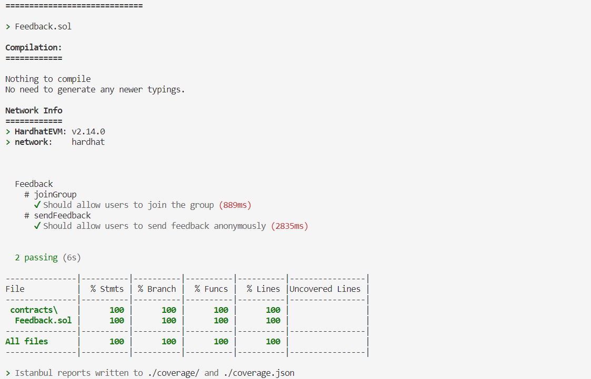

# 第4课 课后作业

Check out https://semaphore.appliedzkp.org/ and set up a starter project!

### Semaphore 是什么

Semaphore使用zk，允许用户证明他们属于某个群体，并发送信号，如投票或认可，而不会泄露他们的原始身份。

### 项目工程搭建

>1. 安装Semaphore Cli
>
>   `npm i -g @semaphore-protocol/cli@latest`
>
>2. 使用Semaphore Cli 来创建Dapp(这里使用mororepo-ethers 的Template)
>
>   `semaphore create my-app --template monorepo-ethers`
>
>3. 编译测试合约
>
>   `npm run compile`
>
>   `npm run test:coverage`

最后的输出结果

